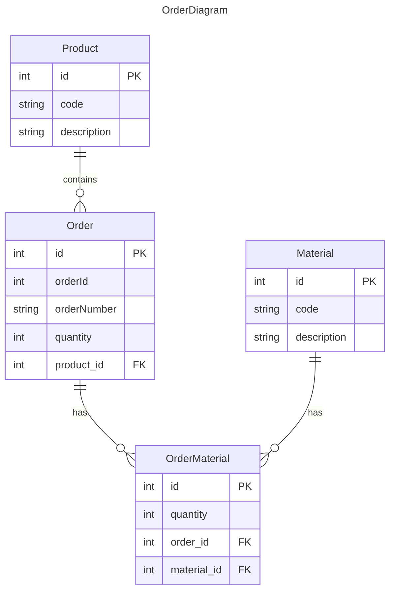

```mermaid

---
title: OrderDiagram
---

erDiagram
    Material {
        int id PK
        string code
        string description
    }

    Product {
        int id PK
        string code
        string description
    }

    OrderMaterial {
        int id PK
        int quantity
        int order_id FK
        int material_id FK
    }

    "Order" {
        int id PK
        int orderId
        string orderNumber
        int quantity
        int product_id FK
    }

    %% Relações

    Product ||--o{ "Order" : contains
    "Order" ||--o{ OrderMaterial : has
    Material ||--o{ OrderMaterial : has
```